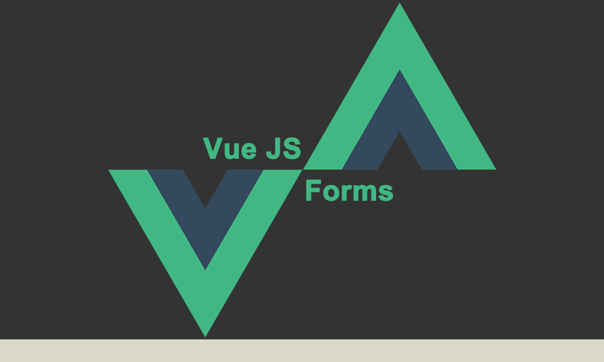

<p align="center">
  
</p>

# Vue Dynamic Form

## Demo

[click me] (https://dymanic-vue-form.netlify.com/)

---

## Build Setup

```bash
# install dependencies
$ yarn

# serve with hot reload at localhost:3000
$ yarn dev

# build for production and launch server
$ yarn build
$ yarn start

# generate static project
$ yarn generate
```

---

## Useful packages


1. [Vuejs](https://vuejs.org/)

2. [Nuxtjs](https://nuxtjs.org/)

---

## Useful utilities

1. [Axios](https://axios.nuxtjs.org/) - Secure and easy axios integration with Nuxt.js

2. [Axios mock adapter](https://github.com/ctimmerm/axios-mock-adapter) - Axios adapter that allows to easily mock requests

3. Vue Toasted - Best Toast plugin available for VueJS
  - [Repo](https://github.com/shakee93/vue-toasted)
  - [Interactive Demo](https://shakee93.github.io/vue-toasted/)

4. [Vee-validate](https://logaretm.github.io/vee-validate/) - Form Validation Framework for Vue.js

---

## Dev Helpers

1. [Nuxt eslint config](https://github.com/nuxt/eslint-config)

2. [Sass-loader](https://github.com/webpack-contrib/sass-loader)

3. [Yarn](https://yarnpkg.com/lang/en/)

---
